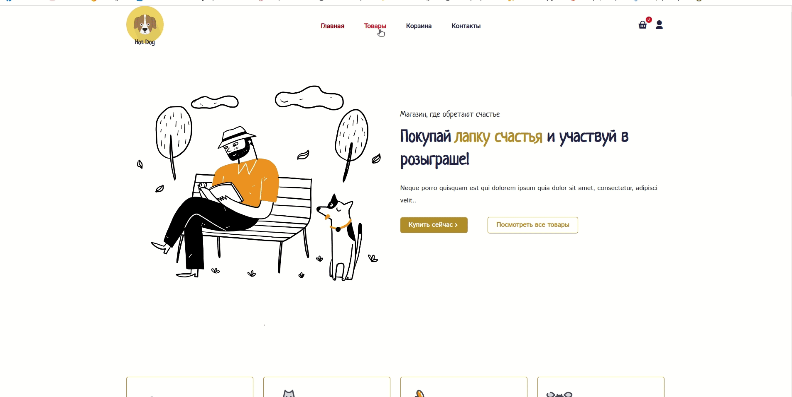

## HotDog App

### Особенности:

---

##### Что можно увидеть в проекте
- Адаптивный дизайн
- Отображение разных страниц(главная,страница товаров,корзина,авторизация)
- Поиск товаров
- Добавление в корзину и ее функционал
- Пагинация страниц
### Технологии которые использовал:

---

1. React
2. Redux Toolkit
3. React Bootstrap
4. React Pagination

## Адаптивный дизайн

## Функционал корзины

## Поиск

### Как начать?

---

##### Чтобы начать проект, просто клонируйте этот репазиторий и запустите доступный код

```javascript
// сначала установить зависимости
npm i
// затем запустить
yarn start
// или
npm start
```
